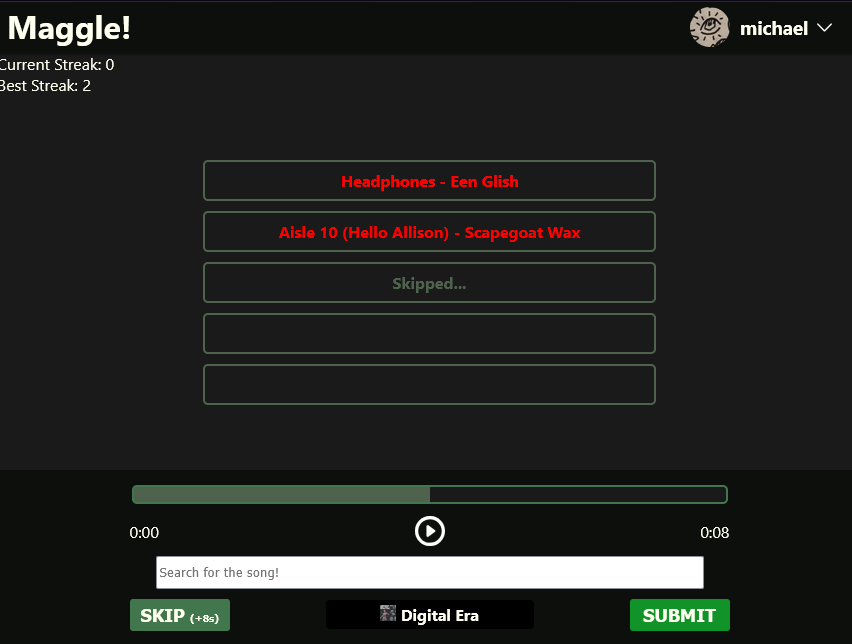
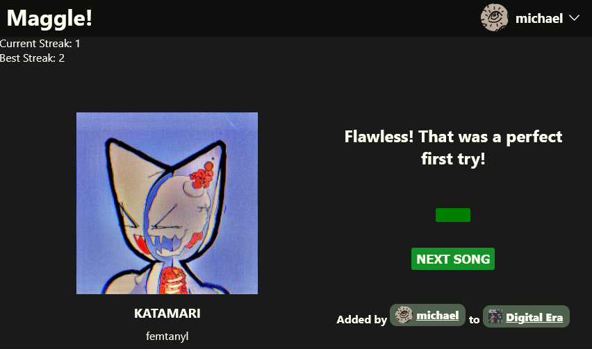

<h1>Maggle</h1>

 A Heardle-like website based on your Spotify playlists! 

  
  
  
    
  

 

<a href="https://aws-deployment.dhqsr5m8z3m6j.amplifyapp.com/login" >Try it out here!</a>

## Features

Maggle is a web app where users guess songs from their Spotify playlists by listening to progressively longer segments of a track. Inspired by the late website [Heardle](https://en.wikipedia.org/wiki/Heardle), Maggle provides an enhanced experience by directly integrating the users’ public Spotify playlists as the target songs.

Additional features include:

- Direct authentication with Spotify (closed beta)
- A public guest mode that allows you to play using any Spotify user's public playlists
- The ability to choose between all public playlists or a specific playlist as the song source
- Progressive audio clips paired with a search bar containing all of a user's publicly saved songs
- Tracking of current and longest streaks for local users (via cookies)
- Five color themes for a customizable experience
- Direct links to the playlist a chosen song is from, and the user that added it to the playlist

<table style="border:0px;">
  <tr>
    <td>

          
_Main view of the app where user can play clips of the target song, and guess._
          
</td>

<td>

            
_End screen where the target song is revealed._
          
</td>
          
  </tr>
  
</table>

>[!NOTE]
> A stand-alone build of this game made using Python and PyGame can be found on the branch `main` of this repository. 

## How It Works

## Known & Resloved Bugs
- [ ] Error playing first song after application loads
- [x] When switching themes, the song progress bar's max length may change
- [x] Issue logging out (duplicate logout btns required)
- [x] Nothing is done if a song preview can't be found 
- [x] No validation check that a song preview matches the requested song
    - If song preview cannot be found or song name doesn't match, that song is skipped.
- [x] Resolve when a component is clicked off of (e.g., search menu for songs / playlists)
- [ ] No check for if current song was previous (or recent) guess
- [ ] Nothing to catch if tracks.data[0] is undefined when fetching song preview

## Planned Features
- [x] Format dropdown menu for profile badge
- [x] Split logic into components
- [x] Remove inline styles from components
- [x] more responses for game over screen
- [ ] Create histogram of guess times (e.g., how many times user guessed the song in 1 second, 2, ...) 
- [ ] Display average time to listen before correct answer
- [x] Make a guest user for those without a spotify account (they can just use a search bar on the login screen to search for a user)
- [ ] Mock more components for jest, and create new suites for other components
